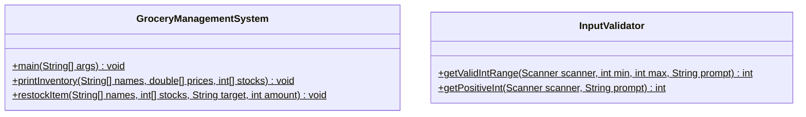
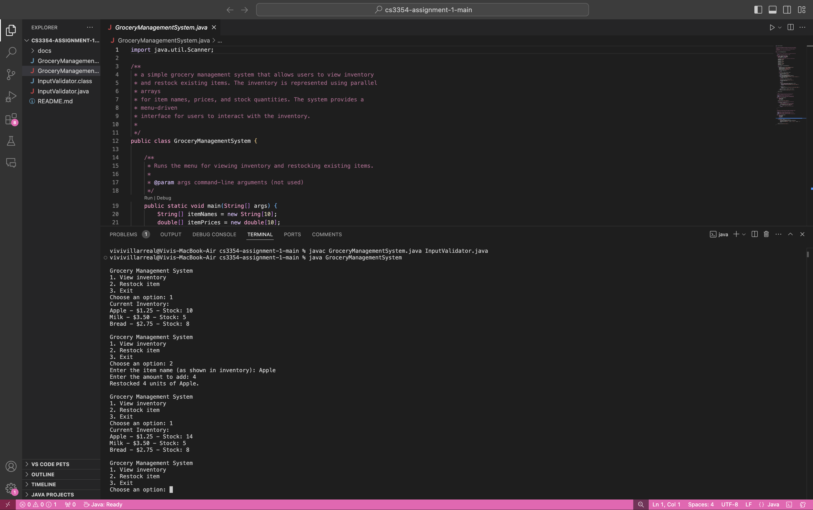
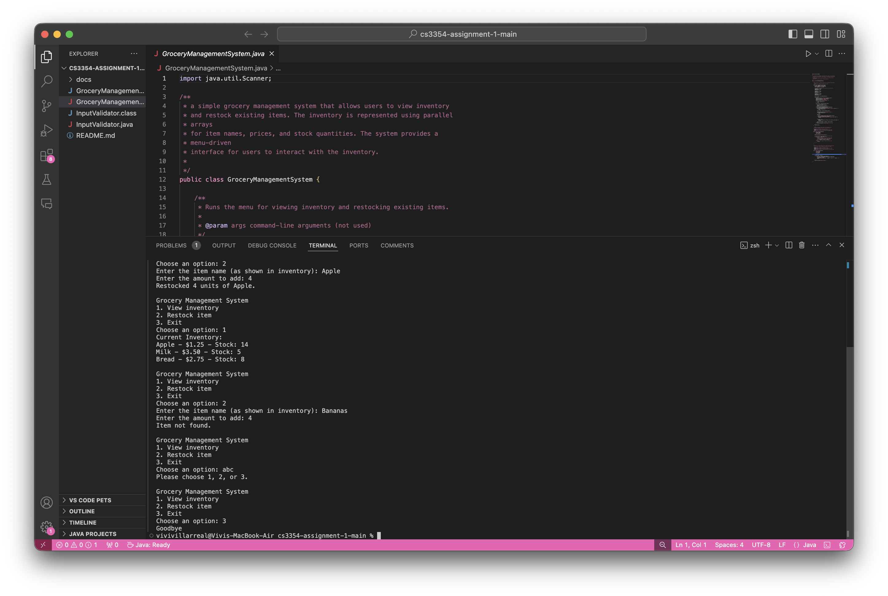
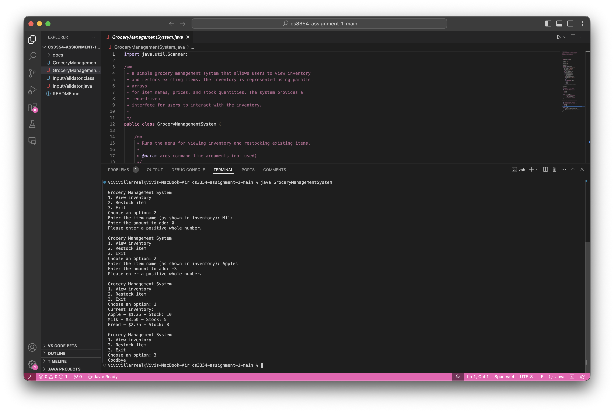

# CS3354 Assignment 1: Grocery Management System

## Project Description

This Java console program allows users to view grocery inventory and restock existing items. Three parallel arrays of length 10 store item names, prices, and stock quantities. The same index identifies the same item across all three arrays.

The starting inventory contains Apple, Milk, and Bread. The remaining array slots are empty.

## How the Program Works

The program uses Scanner to read input and a while loop to repeat the menu.

1. View inventory: displays each item's name, price, and stock. A for loop and if-else check skip slots with null names.
2. Restock item: searches for an exact, case-sensitive item name and adds the requested quantity to its stock. If the item does not exist, the program prints "Item not found."
3. Exit: prints "Goodbye" and ends the program.

The main method validates menu choices and rejects restock amounts that are nonnumeric, zero, or negative.

InputValidator.java contains additional reusable methods for integer range and positive quantity validation. The current main method handles validation directly and does not call InputValidator.

Stock changes last for the current run. Restarting the program restores the starting inventory.

## Compile and Run

A Java Development Kit (JDK) is required. Open a terminal in the folder containing the Java files.

Compile:

```sh
javac GroceryManagementSystem.java InputValidator.java
```

Run:

```sh
java GroceryManagementSystem
```

Enter 1 to view inventory, 2 to restock an item, or 3 to exit.

## Javadoc Documentation

Both Java classes and their methods include Javadoc comments. Generated documentation is stored in the docs folder.

Open docs/index.html in a browser to view the documentation.

To regenerate it:

```sh
javadoc -d docs GroceryManagementSystem.java InputValidator.java
```

## UML Class Diagram

The methods shown below are public and static. The inventory arrays are local variables inside main, rather than class fields. InputValidator is a separate utility class that the current main method does not call.



## Team Contributions

### Alexander Rivas (uql14 / SuiteChaoa)

- Completed the restock and search method on September 28, 2026.

### Vivi Villarreal-Perez (vvivi18v)

- Completed the inventory display method and its Javadoc on September 28, 2026.
- Added inline comments explaining the parallel arrays and empty inventory slots.
- Reviewed the program, collected output screenshots, and updated the README on September 30, 2026.

### Christopher Preddie (Uei8 / cpreddie1-lang)

- Developed the InputValidator class for integer range and positive quantity validation.
- Implemented Scanner buffer handling in the validation methods.
- Added input validation testing notes to the README.

### Bryce Hickey (hxn11 / bryceh23)

- Completed Javadoc comments and generated the docs folder on September 29, 2026.
- Corrected the restockItem Javadoc parameters and documented InputValidator and its methods.

### Brume Esabunor-Nukie (Brume15)

- Set up the GitHub repository and initial Java project structure on September 24, 2026.
- Created the feature-menu branch for the user menu and final integration on September 28, 2026.
- Implemented the Scanner-based menu and while loop.
- Added starting inventory, connected the display and restock methods, and checked menu input and stock updates.

Team members developed their changes on branches and merged them into main through pull requests.

## Testing and Output Screenshots

The Java source files compiled without errors on September 30, 2026. The following checks were performed by running the program on a Mac.

### Inventory Display and Restocking

The initial inventory displayed Apple with stock 10, Milk with stock 5, and Bread with stock 8. Empty slots did not appear.

Restocking Apple by 4 increased its stock from 10 to 14. Milk and Bread stayed unchanged.



### Missing Item, Menu Validation, and Exit

Entering Bananas as the item name printed "Item not found."

Entering abc at the menu printed "Please choose 1, 2, or 3." The program displayed the menu again.

Choosing 3 printed "Goodbye" and returned to the terminal.



### Quantity Validation

Entering 0 for Milk and -3 for Apples printed "Please enter a positive whole number."

Neither attempt changed the inventory. In that fresh run, Apple remained at stock 10, Milk at stock 5, and Bread at stock 8.


